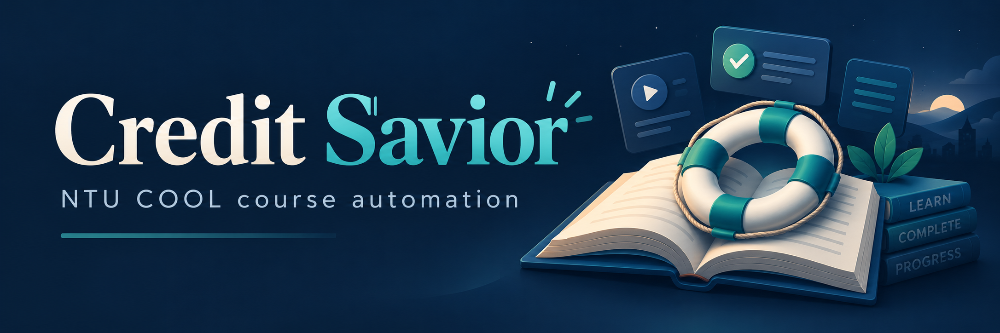

<p align="center">
  
</p>

<p align="center">
  
  
  
  
  <br>
  
  
  
  
</p>

# Credit Savior

把 NTU COOL 的巡課、作業與影片進度交給 coding agent，完成結果直接送到 Discord。

**請使用 coding agent 操作這個專案。** 將本頁最後的訊息交給 Codex 或你使用的 coding agent，由它讀取安裝指南、完成設定並開始運行。你只需在本機對話框提供登入資料，以及補充作業缺少的內容。

## 可以幫你做什麼

### 每 10 分鐘查看所有學生課程

自動巡檢你在 NTU COOL 加入的學生課程，尋找還沒到期、仍可繳交且尚未提交的作業。助教身份的課程會略過；已提交或已截止的作業也會略過。保持電腦開機、登入、連網且不睡眠，就能持續檢查。

### 完成能處理的作業，交付答案與提交結果

使用 **GPT-6.1-Sol** 閱讀題目、要求與支援的附件，產生文字答案、PDF 或文字檔案。答案通過檢查後自動提交，確認網站收到才回報「已提交」。遇到提交途中斷線，會先查網站上的結果，避免直接重複繳交。

### 缺少資料時暫時略過，留下可以接續的事項

題目不完整、報告還沒選主題，或附件目前無法處理時，會列出缺少什麼、為什麼不能完成，以及之後需要詢問的內容。有可交付的部分答案時會附上，明確標為「未提交草稿」。程式作業目前還無法自動驗證執行結果；圖片、Word 等內容也可能需要另外處理，不能保證所有題型都能完成。

### 正常播放影片，斷線後自動接回

以正常 1 倍速播放支援的 NTU COOL 課程影片，依網站觀看紀錄接續未看的部分。播放器失效或播放停住會自動重接；連續失敗後等待 10 分鐘再試。播放結束會再核對網站進度，分別回報「平台已確認完成」或「已播完，進度尚待確認」。如果網站的影片長度與最後一秒紀錄有差異，會保留原因供核對。

### 在 Discord 看答案、提交位置與影片結果

作業產物、草稿、提交結果、影片播完結果與需要處理的問題，都可以送到你指定的 Discord 頻道。每則通知包含 **課程名稱、正式課號、作業或影片標題、主要結果與網站連結**，讓你知道處理了什麼、交到哪裡。

課號取自課程資訊的「課號」欄位；缺少資料時會明示待取得。同一課程的同類影片問題會合併，至少間隔一小時才再通知；已確認送達的相同結果會保存紀錄，避免一般重啟造成洗版。網路中斷時仍可能出現送達回應遺失而重複通知的情況。

### 用本機對話框設定帳密

由 agent 開啟你電腦上的對話框，直接詢問帳號、密碼與選填的 Discord 通知網址。密碼欄會遮蔽，資料保存在你的電腦；保存後清空欄位並關閉視窗，帳密不需要貼進聊天，也不會加入公開專案。已貼進聊天的資料仍需由本人管理，agent 無法保證刪除聊天紀錄或上下文。

### 可以停止、恢復，也可以換電腦接續

保留已完成的答案、待補資料、影片位置與提交紀錄，讓 agent 能在停止後接續工作。同帳號換電腦時，agent 會先停用舊電腦，再搬移工作與通知紀錄，避免兩台同時處理同一門課。電腦登入後可自動開始運行；持續運作仍需要電腦保持可用。

## 複製這段訊息給你的 coding agent

```text
請幫我把 Credit Savior 在這台電腦上設定好並持續運行。
專案：https://github.com/rbt4168/credit_savior

先閱讀專案的 doc/installation-guide.md，再實際完成安裝、登入與驗證。
請用本機對話框直接詢問我的 NTU 帳號、密碼及 Discord 通知網址，
保存後清空欄位、關閉對話框；不要要求我把帳密貼進聊天，
也不要把它們放入記憶、文件或公開紀錄。

每 10 分鐘查看我所有學生課程，處理仍可繳交且尚未提交的作業，
使用 GPT-6.1-Sol 產生答案；通過檢查後自動提交並確認網站收到。
缺題目、缺主題或無法處理時先略過，把原因和之後要問的事項告訴我。

正常播放支援的課程影片，斷線時自動接續，播完也要通知我。
把答案、草稿、提交到哪門課、影片結果與問題送到我的 Discord，
包含課程名稱、課程資訊中的正式課號、作業或影片標題與網站連結。
平台尚未確認完成時請明確說明，不把草稿說成已交或把播完說成進度已滿。

如果是從舊版本更新或換電腦，先保留現有工作與通知紀錄，
確認同一帳號的舊電腦已停止，再接續；不要刪掉資料來排除問題。
最後用簡單的話告訴我哪些功能已經確認可用、還有哪些需要我處理。
```
