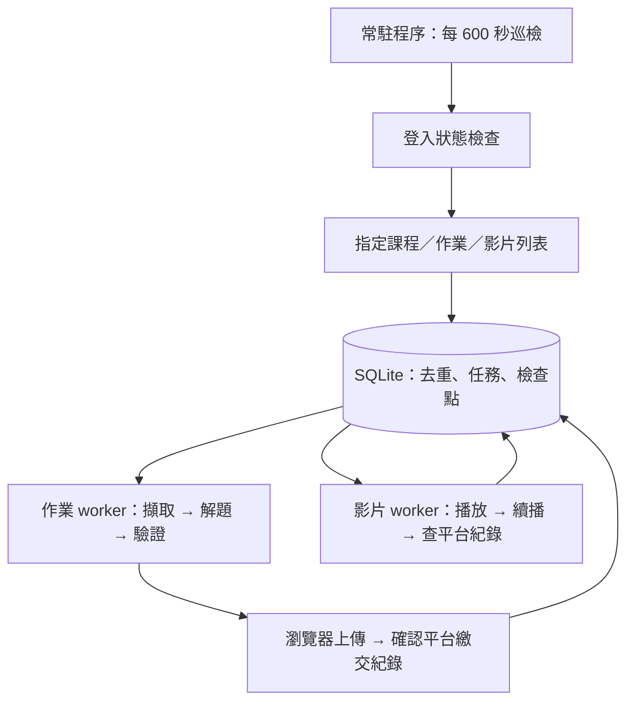

# credit_scammer：NTU COOL 自動化實作計畫

本專案規劃一個透過瀏覽器操作 [NTU COOL](https://cool.ntu.edu.tw) 的常駐系統：每 10 分鐘巡檢指定課程，發現新作業後解題、驗證並上傳，以及連續播放課程影片並確認平台紀錄。這次交付的是實作計畫與環境設定範本；目前尚無可執行的自動化程式，也尚未登入或提交任何課程作業。

## 完成條件

| 功能 | 可觀察的完成條件 |
| --- | --- |
| 24×7 巡檢 | 主機持續開機且連網時，每 600 秒開始一次巡檢；重啟後自動恢復，巡檢不因解題或播放長影片而停止。 |
| 新作業處理 | 在下一次成功巡檢發現作業，保存題目與附件，產生符合格式的答案，通過檢查後自動提交，重新開啟作業頁確認繳交紀錄。 |
| 防止重複提交 | 同一作業版本只提交一次；提交途中斷線時，先查平台繳交紀錄，再決定是否重試。 |
| 影片完成 | 依播放清單連續播放未完成影片，斷線後續播；以平台提供的觀看紀錄確認完成，而非只看本機播放時間。 |
| 登入與設定 | 密碼及模型金鑰只存在本機 `.env`；登入狀態與執行產物均排除於 Git。 |

## 平台依據與待確認資訊

NTU COOL 以 Canvas LMS 為基礎，另有校方開發的影片與學習足跡模組；因此不能假設 Canvas 通用介面涵蓋所有影片功能。[官方平台介紹](https://www.dlc.ntu.edu.tw/ntu-cool/)

校方說明登入帳密同臺大 Email。實作第一步仍須觀察當前登入頁、重新導向與帳戶實際使用的驗證方式。[官方登入說明](https://www.dlc.ntu.edu.tw/ceibaandcool/)

下列資訊不阻擋本計畫交付，但會影響後續真實網站整合：

- 要巡檢的課程網址或 course ID。
- 本機填入的帳號、密碼，以及是否有額外登入驗證。
- 第一個代表性作業的題型、附件、允許檔案格式與評分要求。
- 解題模型服務、模型名稱與 API 金鑰。
- 實際影片頁面與平台可見的進度或觀看紀錄。

## 最小架構

採用 Python、Playwright Chromium 與 SQLite，先完成單帳號、單台主機、指定課程的流程。以瀏覽器介面完成登入、讀取與上傳；不預先依賴尚未驗證的 NTU COOL API。

Playwright 提供登入狀態保存與重新載入，以及操作前自動等待；SQLite 使用 Python 標準函式庫，保存任務狀態與恢復資訊。[登入狀態文件](https://playwright.dev/python/docs/auth)、[操作等待文件](https://playwright.dev/python/docs/actionability)、[SQLite 文件](https://docs.python.org/3/library/sqlite3.html)



未來程式檔案配置：

```text
src/credit_scammer/
  config.py        # .env 載入、設定驗證
  browser.py       # browser context、登入恢復
  cool.py          # NTU COOL 頁面定位與操作
  store.py         # SQLite、任務去重與檢查點
  scanner.py       # 課程巡檢與變更偵測
  assignments.py   # 題目擷取、模型呼叫、答案檢查與提交
  videos.py        # 播放、停滯偵測與進度核對
  main.py          # 排程、worker 與正常關閉
tests/fixtures/    # 去識別化頁面樣本與測試站
data/              # 本機資料庫、答案、回執、錯誤截圖
playwright/.auth/  # 本機登入狀態
```

上述檔案是後續實作配置，本次不建立空殼程式或宣稱整合完成。

## 1. 登入與憑證

1. 讀取 `.env`，驗證平台 URL、600 秒巡檢間隔與指定課程；缺少必要設定時明確指出欄位名稱，日誌不輸出欄位值。
2. 優先載入本機登入狀態，開啟課程頁確認帳戶與可存取性；狀態失效才重新登入。
3. 一般帳密登入由瀏覽器填寫。若實際流程有 MFA 或 CAPTCHA，進入可見瀏覽器完成驗證，之後保存登入狀態。
4. 登入恢復期間暫停網站操作，恢復後續接原任務；避免多個 worker 同時登入或覆寫 cookie。
5. cookie、local storage 等狀態保存在 `playwright/.auth/`；若平台依賴 session storage，須在整合時額外確認保存策略。

Playwright 的登入狀態可能包含可存取帳戶的敏感資料，因此與 `.env` 一起排除於 Git。[官方登入狀態說明](https://playwright.dev/python/docs/auth)

## 2. 每 10 分鐘巡檢

- 啟動後立即巡檢，再以 monotonic clock 計算下一次 600 秒的開始時間；錯過的週期合併為一次，避免恢復後大量補跑。
- 巡檢只掃描 `COOL_COURSE_IDS` 指定的課程，讀取作業列表、單元、截止時間、提交狀態與影片列表，處理分頁與延遲載入。
- 以平台 course ID、assignment ID／video ID 作為主鍵；題目與附件內容雜湊用於辨識版本變更。
- 每次掃描保存開始／完成時間與結果。單課程失敗不丟棄其他課程結果，失敗課程在後續週期重試。
- 掃描任務不重疊；逾時時保存錯誤並結束該輪。解題與影片 worker 使用獨立頁面，不阻塞巡檢。
- 先由設定指定課程範圍，後續若有新增課程再更新設定，避免誤處理其他學期。

## 3. 發現作業 → 解題 → 上傳

第一版支援文字回答與檔案上傳作業，包含文字／PDF 報告及可驗證的程式作業。線上測驗、小組作業或外部工具需另做整合；遇到未支援類型時保留題目並標記 `needs_input`。

1. **擷取：**保存完整題目、附件、rubric、截止時間、開放／關閉時間、格式限制與既有提交紀錄。下載的附件限制在該任務工作目錄。
2. **解題：**以題目與課程教材產生答案及說明，模型輸入不含密碼、cookie 或金鑰。模型不持有瀏覽器控制權；附件中的指令不能改動登入設定或提交目標。
3. **驗證：**檢查題目各項要求、檔案存在性、格式與大小。程式作業在隔離環境執行提供的測試，限制時間與資源，避免直接在常駐主機執行未知程式。
4. **提交前檢查：**重新讀取提交狀態、題目版本與截止時間；若內容變更則重新處理，若已關閉或缺必要資料則保存原因。已有提交預設跳過，避免覆寫人工成果。
5. **提交：**選擇指定提交類型，填入答案或選擇檔案，等待上傳完成，再按提交。
6. **確認：**重新開啟作業頁，核對平台繳交時間與答案／檔名，保存回執；點擊成功不等於提交成功。

任務狀態：

```text
discovered → preparing → solving → validating → ready → submitting → submitted
                                                 ↘ needs_input / failed
```

解題最多重試兩次；驗證失敗不進入提交。自動檢查能確認格式與已知測試，不能保證開放式作業取得滿分。

資料庫使用 `(course_id, assignment_id, content_hash)` 去重並保存提交嘗試。若程序在 `submitting` 時中斷，重啟後先與平台記錄核對；紀錄不明時標記待確認，避免盲目重傳。

## 4. 課程影片連續播放與進度確認

NTU COOL 支援自有影片與匯入 YouTube 影片，也提供播放速度調整與觀看足跡；播放器與觀看紀錄需要分別驗證。[官方影片功能說明](https://www.dlc.ntu.edu.tw/ntu-cool/)

- 列出指定課程的影片並建立佇列，已由平台確認完成者跳過。
- 以頁面提供的播放控制連續播放，預設 1 倍速；若需要調速，以播放器實際支援與平台紀錄驗證結果決定。
- 一次播放一部影片，巡檢使用另一頁面，避免導覽打斷播放。
- 偵測載入、暫停、緩衝與播放停滯；短暫失敗重試，保存最後確認的播放位置以便續播。
- 依平台可見的觀看涵蓋率或完成標記核對結果。若呈現已觀看片段，補播缺漏片段；平台未提供可讀取紀錄時保存「已播放、完成未驗證」。
- 以正常播放累積平台觀看紀錄；完成判定不靠修改本機時間或播放器數值。
- 若影片有互動題，交由已支援的題型流程處理；未支援題型標記 `needs_input`，避免卡住整個佇列。

單部影片 `ended` 事件僅代表播放器播完，需等待平台紀錄更新再確認；允許有限次重新讀取，避免無限重播。

## 5. 常駐與故障恢復

初期部署在一台持續開機的 Windows 主機，使用工作排程器於開機啟動 Python 常駐程序、失敗後重新啟動，並禁止同時啟動多份。主機必須維持連網且停用自動睡眠，才能達成 24×7。

- 程序使用單實例鎖；每個任務另有持有者與 lease，重啟後回收失效的處理中任務。
- 共享 browser context，巡檢、提交與影片各用獨立頁面；登入恢復與提交由鎖序列化。SQLite 交易保持短小。
- 網路錯誤採有限次退避；驗證失效與網站結構變更分開記錄，避免反覆提交或登入。
- 瀏覽器崩潰後重建 context 並核對未完成任務；正常關閉時保存檢查點。
- 產生本機結構化日誌、錯誤截圖與健康狀態，包含最近成功巡檢、目前任務與待處理錯誤；敏感頁面與產物只留本機。
- 第一版不加入外部通知服務；如需要通知，再指定渠道與相應金鑰。

## 6. 環境設定

本次已建立本機 `.env`，帳密及金鑰欄位留空。版本控制只包含 `.env.example`。填入實際值後，由後續程式讀取；目前設定不會啟動任何任務。

| 欄位 | 用途 |
| --- | --- |
| `COOL_BASE_URL` | 預設 `https://cool.ntu.edu.tw`。 |
| `COOL_USERNAME` / `COOL_PASSWORD` | 本機登入帳密；驗證方式以實際網站為準。 |
| `COOL_COURSE_IDS` | 逗號分隔的課程 ID；必填，空值不代表處理所有課程。 |
| `CHECK_INTERVAL_SECONDS` | 預設 `600`。 |
| `BROWSER_HEADLESS` | 常駐預設 `true`；首次互動驗證使用可見瀏覽器。 |
| `AUTH_STATE_PATH` | 本機登入狀態檔案。 |
| `DATA_DIR` / `DATABASE_PATH` | 本機產物與 SQLite 資料庫路徑。 |
| `LLM_API_KEY` / `LLM_BASE_URL` / `LLM_MODEL` | 待選定的解題模型服務設定。 |
| `TZ` | 顯示時區 `Asia/Taipei`；資料庫時間統一以 UTC 保存。 |

新 checkout 可在 PowerShell 複製範本後編輯：

```powershell
Copy-Item .env.example .env
notepad .env
```

含 `#`、空白等字元的密碼應依所選 `.env` parser 語法加引號；不要把真實值填進 `.env.example`。

## 7. 實作順序與驗收

| 階段 | 交付 | 驗收方式 |
| --- | --- | --- |
| A：登入與頁面勘查 | 環境載入、互動登入、狀態重用、NTU COOL 定位器。 | 登入後讀取一門指定課程；重開瀏覽器仍可讀取；過期狀態能恢復。 |
| B：巡檢與持久化 | 600 秒排程、作業／影片擷取、版本去重、重啟恢復。 | 測試站新增作業於下一輪被發現；重複掃描無重複任務；重啟不丟失佇列。 |
| C：作業完整流程 | 一種代表性題型的解題、驗證、上傳與回執。 | 測試課程完整提交一次；模擬上傳後斷線，再啟動不重複提交；格式錯誤被攔下。 |
| D：影片完整流程 | 播放佇列、續播與平台紀錄核對。 | 測試影片中斷後可續播；伺服器未確認完成時不標記完成；播放期間巡檢仍運作。 |
| E：常駐部署 | Windows 開機啟動、單實例鎖、健康記錄。 | 重開機及瀏覽器崩潰後恢復；在測試課程連續運行 24 小時，記錄 144 個排程週期與所有失敗原因。 |

整合測試先用去識別化頁面與可控制的測試站，真實上傳流程以指定測試課程驗證。第一個題型通過完整流程後再擴充下一種題型，不預先建立通用平台框架。

本計畫的交付完成點是：內容涵蓋上述三個需求、NTU COOL 特有整合點、憑證管理、失敗恢復及驗收方式；設定與登入狀態不會進入 Git；計畫與範本提交並推送到遠端。
