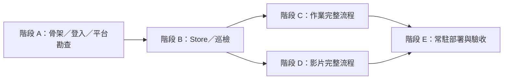

# NTU COOL 自動化實作計畫

本文件定義系統目標、工作拆解與驗收；詳細介面與資料契約位於 doc/system。此階段只交付計畫、詳細設計與設定範本，沒有已運行的巡檢程序，也沒有登入、提交作業或更改影片觀看紀錄。

## 需求與完成條件

| ID | 需求 | 可觀察的完成條件 |
| --- | --- | --- |
| R1 | 每 10 分鐘全天巡檢。 | 正常開機連網環境下，每 600 秒開始一輪；每輪有結果，長作業與影片不阻塞排程。 |
| R2 | 發現新作業並解題。 | 下一次成功完整巡檢建立唯一 job，保存完整題目與附件，產生支援格式的答案與驗證報告。 |
| R3 | 直接上傳並確認。 | 驗證通過且題目未變、平台未繳交時自動提交，重新讀取平台回執後才標記完成。 |
| R4 | 防止重複提交。 | 相同版本不重複入列；任何未決提交先核對平台，未知結果不直接重送。 |
| R5 | 影片連續播放到完成。 | 播放佇列、中斷續播與缺漏片段處理正常；只有平台完成證據才標記 completed。 |
| R6 | 本機驗證設定。 | 帳密與金鑰使用 .env，登入狀態與產物不進 Git，模型輸入不含憑證。 |
| R7 | 常駐與故障恢復。 | Windows 開機啟動、單實例鎖、健康記錄、browser crash 與程序重啟恢復通過。 |
| R8 | 可驗證交付。 | 測試矩陣、提交崩潰邊界、指定課程實測與 24 小時 soak 均有證據。 |

「每輪發現」成立的前提是課程範圍能在 480 秒 budget 內完成。登入失效、平台停機與主機離線時保存缺口；不能宣稱仍有成功巡檢。影片不可見平台紀錄時只記 played_unverified；開放式答案的格式驗證不保證得分。

## 第一版範圍

單帳號、單 Windows 主機、明確指定 course ID。採 Python、Playwright Chromium、SQLite。以 browser UI 讀取與提交，先支援文字回答／檔案上傳與一種已驗證播放器；第二種播放器與程式題型按驗收順序加入。

程式作業需先有隔離 runner；不支援的小組作業、線上測驗與外部工具保存 needs_input。第一版不建立管理網站、多帳號服務或外部通知。缺資料與未決結果是具體任務狀態，不是每次都需人工批准的提交流程。

## 平台依據與整合待確認

NTU COOL 使用 Canvas LMS 為基礎，另有自訂影片模組與學習足跡，需分開驗證兩種介面。[官方平台介紹](https://www.dlc.ntu.edu.tw/ntu-cool/)

校方說明登入帳密同臺大 Email；實際登入 redirect、MFA 與驗證期限以勘查為準。[官方登入說明](https://www.dlc.ntu.edu.tw/ceibaandcool/)

| 資訊 | 取得方式 | 阻擋哪一階段 |
| --- | --- | --- |
| 指定課程 ID／網址 | 填入本機 COOL_COURSE_IDS。 | 真實課程巡檢。 |
| 帳密與額外驗證 | 本機 .env 及可見 auth 流程，不寫入對話文件。 | 真實登入。 |
| 測試課程與代表性題目 | 指定可驗收的文字／檔案作業。 | 真實提交驗收。 |
| 模型服務、endpoint、模型及金鑰 | 選定一個服務並填入本機設定。 | Solver 整合。 |
| 影片與學生可讀進度頁 | 登入後勘查、保存去識別化 fixture。 | 真實觀看完成核對。 |
| 程式 runtime 與 runner | 依代表性程式作業固定 image 與測試。 | 程式題型啟用。 |

以上資訊不阻擋文件交付；對相依實作沒有資料時，先完成測試站與純邏輯，不編造網站 selector 或 API。

## 系統文件與需求對應

| 文件 | 設計內容 | 需求 |
| --- | --- | --- |
| [架構](system/architecture.md) | 模組簽名、asyncio、頁面所有權、鎖順序、context generation。 | R1–R7 |
| [平台整合](system/platform-integration.md) | 勘查契約、locator、fixture、DTO 與錯誤分類。 | R2–R6 |
| [資料模型](system/data-model.md) | SQLite schema、content_hash、claim、lease、提交唯一限制。 | R2–R4、R7 |
| [登入](system/authentication.md) | 狀態重用、互動驗證與恢復。 | R6、R7 |
| [巡檢](system/scanner.md) | 固定週期、完整性、budget、版本與入列。 | R1、R2、R4 |
| [作業](system/assignments.md) | Solver／Validator 契約、submit intent、reconciliation。 | R2–R4 |
| [影片](system/videos.md) | player adapter、checkpoint、stall、平台完成證據。 | R5 |
| [設定](system/configuration.md) | .env schema、路徑、固定常數。 | R6 |
| [運行](system/operations.md) | CLI、Windows 啟動、健康檔、故障矩陣。 | R7 |
| [測試](system/testing.md) | 完整測試矩陣、side-effect 邊界、soak 指標。 | R8 |

## 實作相依順序

單次開發先完成一條可驗收路徑，再擴大題型。C 與 D 共用 A／B 介面，可分先後交付；不為尚未驗證的題型加入框架。

## 工作拆解

| 工作 | 交付內容 | 驗收／相依 |
| --- | --- | --- |
| A1 | Python package、CLI 入口、Config 與 secret 去敏感。 | CFG-01～03；程式能檢查設定，不執行網站提交。 |
| A2 | BrowserSession、三個角色頁面、gate／generation。 | 同時頁面操作不互相導覽，過期 handle 被拒絕。 |
| A3 | auth 指令、狀態原子保存、帳戶核對。 | AUTH-01～03；需真實登入才能完成平台驗收。 |
| A4 | CoolClient 勘查與去識別化 fixture。 | login、列表、提交與影片所需欄位皆有證據。 |
| B1 | schema v1、Store、content_hash、產物寫檔。 | DB-01～04；未知 schema 不刪庫重建。 |
| B2 | monotonic 排程、scan budget 與 course cursor。 | SCAN-01～03、05；600 秒週期無漂移。 |
| B3 | 完整擷取、附件版本、去重與 superseded。 | SCAN-04；同一題目只建立一次 job。 |
| B4 | 恢復 lease 與未完成 scan。 | 重啟保留佇列；失效 worker 不寫入。 |
| C1 | 一種題型的 ProblemBundle、Solver、答案渲染。 | HW-01～03；服務未設定保留原因。 |
| C2 | Validator、產物雜湊、提交前重讀。 | HW-03～05；資料／格式錯誤不進 ready。 |
| C3 | prepared／dispatching intent、最終點擊、回執核對。 | HW-06～07 及七個崩潰邊界。 |
| C4 | CodeRunner 及第一種程式 runtime。 | HW-08；隔離未完成時只啟用文字／PDF。 |
| D1 | 第一種 player adapter、播放清單。 | VID-01、05；實際播放器可控制。 |
| D2 | checkpoint、續播、stall 與有限重開。 | VID-02～03。 |
| D3 | 平台進度讀取、缺漏補播與未驗證狀態。 | VID-01、04；ended 不直接等於完成。 |
| D4 | 第二種已確認播放器。 | 若指定課程需要 YouTube，完成相應 fixture 及實測。 |
| E1 | Supervisor、單實例鎖與關閉。 | OPS-01～03；不丟失 dispatch intent。 |
| E2 | health.json、JSONL、status 與故障診斷。 | 狀態區分 stale、degraded、waiting_auth。 |
| E3 | Windows 啟動腳本、有限重啟及 backup。 | 開機與 crash 後恢復，設定錯誤不反覆重啟。 |
| E4 | 指定測試課程完整流程。 | 真實作業回執、影片平台完成證據。 |
| E5 | 24 小時 soak 與交付摘要。 | OPS-04，144 個排程時間格均有結果。 |

案例定義見[測試矩陣](system/testing.md)。工作拆解是待辦計畫，不代表目前已完成上述程式或測試。

## 階段退出條件

- A：有效登入能讀指定課程，fixture 可重現頁面契約，失效登入可診斷。
- B：測試站下一輪發現新作業，完整版本去重、單輪不重疊、重啟不丟任務。
- C：代表性作業可自動解題、驗證並確認平台提交；未知回應不重送。
- D：影片正常續播與平台核對通過，長播放不阻塞 scanner。
- E：Windows 啟動、錯誤分類、七個提交崩潰邊界及 24 小時 soak 都有可重現證據。

## 主要風險與處理

| 風險 | 設計處理 | 交付限制 |
| --- | --- | --- |
| 登入需要互動驗證 | auth 指令、狀態保存、waiting_auth。 | 無法保證登入永不需要本人操作。 |
| 頁面改版 | 平台契約集中於 CoolClient，fixture 回歸。 | layout_changed 時停止相關寫入。 |
| 遠端提交結果不明 | dispatch intent 與只讀 reconciliation。 | 沒有 server idempotency key，不能宣稱 exactly-once。 |
| 題目與附件超出處理能力 | 明確支援格式、大小上限與 needs_input。 | 不能保證任意題型自動完成或滿分。 |
| 影片觀看紀錄不可見 | played_unverified 與後續只讀核對。 | 不以本機播放代替平台完成證據。 |
| 課程範圍超出 480 秒 budget | cursor、公平續掃與容量告警。 | 容量不足時 R1／R2 不算通過。 |

## 文件階段完成條件

doc/plan.md 與 doc/system/*.md 可互相導覽；詳細設計包含可實作介面、DDL、狀態轉移、逾時、重試、恢復及測試。README 作為入口，.env 與登入狀態保持本機。檢查文件連結、DDL 與 Git 排除後提交並直接推送。

系統實作完成另以 A～E 階段證據判定，不能用文件完成取代真實平台驗收。
