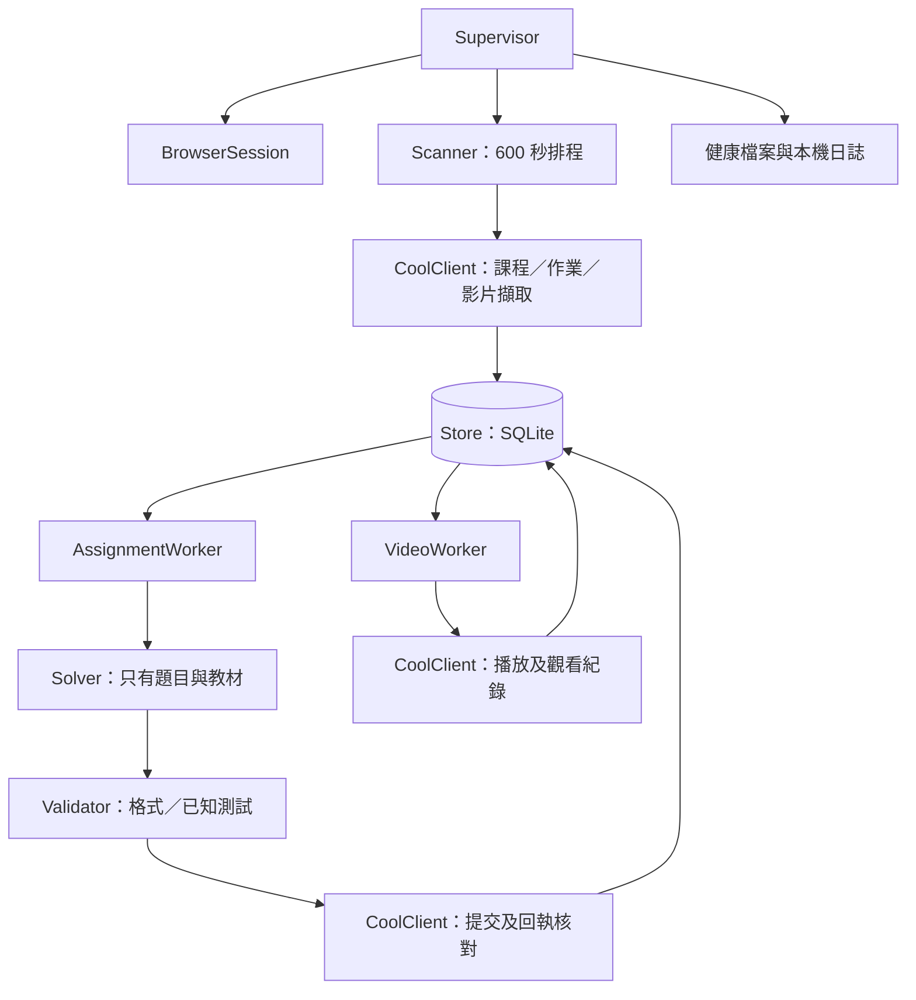

# 系統架構

[實作計畫](../plan.md) · [資料模型](data-model.md) · [平台整合](platform-integration.md)

## 設計狀態與範圍

本文件是待實作的設計契約，程式與真實網站整合尚未完成。第一版只服務一個 NTU COOL 帳號、一台 Windows 主機及明確指定的課程；不建立多租戶平台、分散式佇列或管理網站。

技術組合為 Python、Playwright Chromium、SQLite。以瀏覽器操作網站，模型僅負責產生答案；模型不能取得登入憑證、直接操作瀏覽器或決定提交目的地。

## 程序與資源所有權

單一 Python 程序使用一個 asyncio event loop。Supervisor 管理 scanner、assignment worker、video worker 與 heartbeat 四個長存任務。任務中的例外由各 worker 轉換為可持久化錯誤；未處理的程序級錯誤才交由 Supervisor 重建或退出。

| 元件 | 持有資源 | 責任 |
| --- | --- | --- |
| Config | 已驗證、不可變的設定 | 載入設定、檢查缺漏、解析路徑。 |
| BrowserSession | browser、context、角色頁面、登入鎖 | 登入恢復、context 世代與頁面生命週期。 |
| CoolClient | 頁面操作契約 | 擷取、播放與提交，回傳標準資料，不管理排程。 |
| Store | 單一 SQLite connection | 交易、去重、任務 claim、lease 與事件紀錄。 |
| Scanner | scanner page | 每 600 秒更新課程、作業及影片資料。 |
| AssignmentWorker | assignment page、模型 client | 一次處理一件作業，驗證後提交。 |
| VideoWorker | video page | 一次播放一部影片，保存檢查點。 |
| Supervisor | 程序停止事件、各 task | 啟動、健康檢查、正常關閉與局部恢復。 |

SQLite 操作集中於 Store；短交易在同一執行緒完成，不在交易內等待網路或模型。附件解析與同步模型 SDK 等阻塞工作移至受控 background thread；不把 Playwright Page 跨執行緒傳遞。asyncio 的任務取消與背景執行能力見[官方文件](https://docs.python.org/3/library/asyncio-task.html)。

## 資料流



## 模組介面

下列簽名為設計契約；資料型別定義見[資料模型](data-model.md)。

```python
class BrowserSession:
    async def ensure_ready(self) -> int: ...  # 回傳 context generation
    async def page(self, role: str) -> PageHandle: ...
    async def recover(self, reason: str) -> None: ...
    async def close(self) -> None: ...

class CoolClient:
    async def list_courses(self, course_ids: list[str]) -> list[CourseSnapshot]: ...
    async def list_assignments(self, course_id: str) -> list[AssignmentRef]: ...
    async def read_assignment(self, ref: AssignmentRef) -> AssignmentSnapshot: ...
    async def read_submission(self, ref: AssignmentRef) -> SubmissionObservation: ...
    async def stage_answer(self, ref: AssignmentRef, answer: AnswerArtifact) -> None: ...
    async def click_submit(self, ref: AssignmentRef) -> None: ...
    async def list_videos(self, course_id: str) -> list[VideoSnapshot]: ...
    async def read_playback(self, video: VideoSnapshot) -> PlaybackObservation: ...
    async def start_playback(self, video: VideoSnapshot, position_s: float) -> None: ...
    async def read_video_progress(self, video: VideoSnapshot) -> ProgressObservation: ...

class Solver:
    async def solve(self, problem: ProblemBundle) -> AnswerArtifact: ...

class Validator:
    async def validate(self, problem: ProblemBundle,
                       answer: AnswerArtifact) -> ValidationResult: ...

class Store:
    def enqueue(self, job: NewJob) -> bool: ...  # duplicate 回傳 False
    def claim(self, kind: str, owner: str, now_ms: int) -> Job | None: ...
    def checkpoint(self, job_id: str, owner: str, update: JobUpdate) -> None: ...
    def renew_lease(self, job_id: str, owner: str, now_ms: int) -> bool: ...
```

操作都帶有固定的課程與 subject ID。每個角色建立自己的 CoolClient(session, role)，由 role 取得 PageHandle；scanner client 不提供提交操作。CoolClient 不接受模型產生的任意 URL；傳入目標必須由已擷取的指定課程資料建立。平台定位器只存在於 cool.py，不散落於 worker。

## 並行與鎖

- scanner、assignment、video 各有一個頁面。影片播放不佔用 scanner 的頁面，也不因解題開始而導覽。
- 登入恢復採 exclusive gate：停止發出新網站操作，等待現有操作完成或達到逾時，再重建 context。gate 不是所有 worker 共用的長時間工作鎖。
- 所有最終作業提交由 submission lock 序列化；不持有此鎖等待模型生成或播放影片。
- PageHandle 帶 generation。context 重建時 generation 加一，舊 handle 立即失效，worker 重新取得頁面並讀取平台狀態。
- 鎖取得順序固定為 session gate → submission lock → 短 Store 交易；禁止持有 Store 交易等待任何 asyncio lock。
- 需要登入恢復的操作先釋放 operation gate 與 submission lock，再取得 exclusive gate；不能在持有讀取 gate 時遞迴要求恢復。
- 任務 lease 用來辨識處理中工作與故障恢復；SQLite 唯一限制用來避免重複入列。兩者均不能替代平台繳交回執。
- claim 成功後啟動獨立 lease keeper，每 30 秒更新；模型請求、影片驗證及 120 秒上傳等待均不阻塞續租。續租失敗通知持有者停止新的平台寫入。

## 啟動與關閉

啟動順序：設定驗證 → 單實例鎖 → Store schema 檢查 → 回收失效 lease → BrowserSession → 登入檢查 → 四個長存任務。任何必要前置步驟失敗都不進入提交或播放。

關閉順序：停止入列與 claim → 保存播放檢查點 → 等待正在核對的提交 → 記錄未決提交 → 關閉 browser → 關閉 Store → 釋放單實例鎖。30 秒內未完成的工作保存階段後取消；取消不代表平台操作已被撤銷。

## 規劃程式配置

```text
src/credit_scammer/
  config.py         # 設定解析
  browser.py        # session、gate、generation
  cool.py           # 頁面定位器與標準化擷取
  models.py         # 文件所定義的 DTO 與列舉
  store.py          # SQLite 與短交易
  scanner.py        # 排程、擷取、入列
  assignments.py    # 作業狀態流程
  solver.py         # 單一模型服務的轉接
  validation.py     # 產物驗證
  videos.py         # 播放與進度核對
  main.py           # CLI 與 Supervisor
tests/fixtures/     # 去識別化頁面與可控制的測試站
data/               # 本機任務、答案、回執、健康與日誌
playwright/.auth/   # 本機登入狀態
```

上述路徑是預定配置，並非目前已可執行的檔案。
