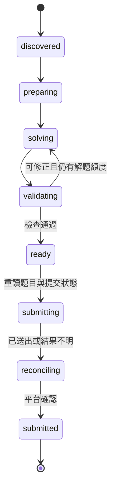

# 作業解題與提交詳細設計

[實作計畫](../plan.md) · [資料模型](data-model.md) · [平台整合](platform-integration.md)

## 支援範圍

第一個可交付流程以文字回答或檔案上傳作業為主：UTF-8 文字與可抽取文字的 PDF 題目，輸出文字或 PDF 報告。程式作業在隔離 CodeRunner 通過驗收後啟用。小組作業、線上測驗、外部工具、加密或純影像題目先保存 needs_input 與原因。

第一版直接在通過驗證後提交，不加入每份作業都需人工批准的流程。已有平台提交會跳過；缺漏或未決結果則保留資料與診斷，不能假設答案或平台狀態。

## 任務階段



所有階段均可因不可恢復問題進 needs_input／failed，或因新版本、已有提交進 cancelled；這些是 jobs.state，並非假裝已完成的 phase。

| phase | 前置條件 | 保存的 checkpoint | 下一步 |
| --- | --- | --- | --- |
| discovered | 題目完整且版本固定。 | snapshot_path、content_hash。 | preparing。 |
| preparing | lease 有效、附件完整。 | 解析結果、教材 manifest。 | solving 或 needs_input。 |
| solving | 題型支援、模型設定有效。 | model_attempts、request_digest、答案 manifest。 | validating。 |
| validating | 答案產物存在。 | 每項檢查與錯誤。 | ready、重解或 needs_input。 |
| ready | 驗證通過。 | answer_hash、validation_path。 | 提交前重新擷取。 |
| submitting | 相同題目版本、presence=absent、無 pending attempt。 | attempt_id 與 intent。 | reconciling。 |
| reconciling | 有已送出或未決 intent。 | 平台 observation、核對次數。 | submitted 或 needs_input。 |
| submitted | 平台有匹配回執。 | receipt_path、platform_attempt_id。 | state=succeeded。 |

## ProblemBundle 建立

保存題目全文、rubric、deadline／lock time、提交類型、允許副檔名與附件雜湊。課程教材只能從同一指定課程已確認的教材清單取得，按題目相關性與輸入容量納入；不把瀏覽器狀態、所有課程資料或私人帳戶頁面交給模型。

附件抽取規則：文字檔檢查編碼與長度；PDF 檢查可抽取正文與頁數。題目引用無法取得的圖表、掃描頁或資料集時 needs_input/missing_problem_material，不以猜測補齊。保存來源與納入／省略的教材項目以便重現。

## Solver 契約

模型服務在實作前選定一個，不建立多服務路由。Solver 接收 ProblemBundle，回傳受 schema 限制的內容；必要時將大型題目按結構拆分，但最終答案仍核對所有題目要求。

```json
{
  "schema_version": 1,
  "answer_kind": "files",
  "artifacts": [
    {
      "logical_name": "report",
      "format": "pdf",
      "content": "待渲染的報告正文"
    }
  ],
  "requirement_checks": [
    {"requirement": "題目第一小題", "covered": true}
  ],
  "missing_information": []
}
```

這是回應契約示例，不是已產生的答卷。模型只指定 logical_name 與受支援格式；本機產生實際檔名、路徑及 PDF。輸出不得含 shell 命令、任意下載 URL 或提交指令。回應無法解析、缺必要資料或格式不支援時不進入 ready。

首次嘗試外最多重試兩次，總共三次模型請求，每次 180 秒。驗證失敗後的修正使用同一三次額度；checkpoint 在請求前增加計數，程序重啟不重置。服務限流可依已知 retry delay 延後，但仍受總額度限制。

## Validator 契約

| 檢查 | 通過條件 | 失敗行為 |
| --- | --- | --- |
| 題目覆蓋 | 題目可識別的必填項目均有對應答案段落。 | 帶缺漏項目修正，或 needs_input。 |
| 產物完整 | manifest 中檔案存在、可讀、雜湊一致。 | artifact_invalid。 |
| 格式 | 副檔名、檔案內容與平台允許格式一致。 | 重新渲染或 unsupported_output_format。 |
| 大小 | 不超過平台限制與本機固定上限。 | 不能默默截斷答案，改修正或 needs_input。 |
| PDF 可讀 | 可解析、至少一頁，文字不被截斷。 | 渲染修正。 |
| 程式測試 | 在 CodeRunner 中通過題目提供的測試。 | 帶有限輸出修正。 |
| 來源 | 引用的教材與資料對應實際提供來源。 | 缺來源不編造引用。 |

模型自行回傳 covered=true 只是待核對資訊，不當成獨立驗證。開放式推理的正確性不能由格式檢查證明；驗證結果必須標明實際檢查範圍。

## 程式作業的隔離執行

CodeRunner 是啟用程式題型的前置條件，不能在常駐 Windows 程序直接執行下載或模型產生的程式。規劃使用獨立 container runner，契約要求：停用網路、非管理員執行、只讀題目輸入、獨立暫存輸出、CPU／記憶體／程序數／時間限制，以及容器退出後清理。

初始每個測試限制 60 秒、512 MiB，截取 stdout／stderr 各 64 KiB。實際 runtime image 依第一個代表性程式作業選定並固定版本；runner 未安裝、語言不支援或隔離測試不通過時 needs_input/runner_unavailable。容器引擎為程式題型的額外部署成本，文字與 PDF 題型不依賴它。

## 最終提交前檢查

依固定順序先取得 session operation gate，再取得 submission lock，確認 session generation 與 lease 仍有效，重新讀取完整題目及附件版本、平台提交狀態與開放狀態。登入失效時先釋放兩個鎖再恢復。

- 題目 content_hash 不同：舊 job cancelled，新版本由 scanner 入列。
- 已有平台提交：cancelled/already_submitted；不覆寫人工成果。
- presence=unknown：needs_input/submission_state_unknown。
- 尚未開放：retry_wait 至 unlock_at_ms。
- 已關閉：needs_input/assignment_closed。
- 超過 due_at_ms 但平台仍明確接受遲交：可提交，回執記錄 late；不修改日期或平台狀態。
- 正常可提交：繼續準備 attempt。

上述重讀至最終點擊超過 15 秒時，再確認提交與開放狀態。重讀並非伺服器交易鎖；仍可能與使用者在另一個瀏覽器提交競爭，因此必須保留平台證據與未知結果分支。

## 提交 intent 與回執

1. 保存答案、validation 與 answer_hash。
2. 建立 prepared attempt；資料庫限制同一作業只能有一個 pending attempt，即使題目版本不同也不能繞過。
3. stage_answer：填入文字或完成檔案上傳，確認表單上的實際檔案與答案。此時尚未點擊最終提交；草稿檔案依平台 file ID 去重，不重複加入同一檔案。上傳最多等待 120 秒，完成後再次檢查提交與開放狀態。
4. 最後確認 lease／generation，將 attempt=dispatching、job.phase=submitting COMMIT。
5. 只點擊一次最終提交按鈕。點擊例外或 browser crash 不視為「一定沒送出」。
6. 進 reconciling，依 2、5、10、20、30 秒間隔只讀查回執。
7. presence=present 且與本次答案匹配：保存回執，attempt=confirmed、job=succeeded/submitted。
8. 已有提交但不匹配：停止本次寫入，保存 observation 與 needs_input/submission_conflict。
9. 平台明確拒絕且證實未提交：attempt=rejected；可恢復的表單錯誤修正後走新 attempt，不重用舊 intent。
10. 無可靠結果：attempt=uncertain、job=needs_input/submission_uncertain。後續成功巡檢可將原 job 排回 queued/reconciling，僅核對既有 attempt；不能因看不到回執而直接重傳。

prepared attempt 尚未保存 dispatch intent，遇到題目被取代或已由其他瀏覽器提交時可改 abandoned，釋放 pending 限制。dispatching／uncertain 不能用 abandoned 跳過平台核對。

本機 unique key 可防重複入列，不能提供遠端 exactly-once 保證。瀏覽器提交沒有已驗證的 server idempotency key；設計在未知結果時停止重送，以避免盲目產生重複繳交。

## 重啟恢復

| 最後保存階段 | 恢復策略 |
| --- | --- |
| preparing／solving | 驗證快照與已用請求額度，缺答案才續解。 |
| validating／ready | 驗證 answer_hash 與產物，重做必要檢查，不重新生成完整答案。 |
| prepared attempt | 查提交狀態後確認是否可重新 stage；尚未存在 dispatch intent 才可點擊。 |
| dispatching／uncertain | 只讀 reconciliation，禁止直接再次點擊。 |
| confirmed | 核對本機 receipt 存在，保持 succeeded。 |
| missing artifact | needs_input/artifact_missing，不能上傳不完整產物。 |

沒有 pending attempt 的失敗 job 可由未來 retry CLI 明確重新排程；pending attempt 必須先解決回執，不允許通用 retry 命令清除未知結果。
